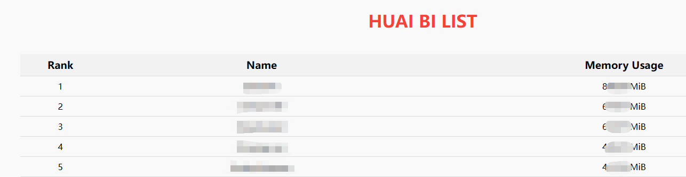
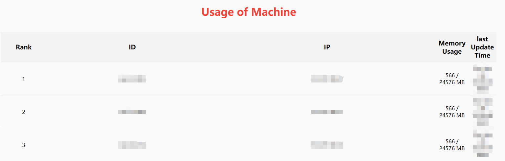

# Introduction

This is a project for detecting the Graphic Memory Usage of HPC cluster. Please log into the VPN of MBZUAI and connect to [index](http://10.127.30.11:12600/) for available gpus and [user](http://10.127.30.11:12600/user) for detailed usage of each user.

The examples are shown as followed.

- Index


- User


# How to deploy your own Huaibi Detector

1. First you need to clone the repo
```
git clone git@github.com:sanshuiii/Huaibi-Dector.git
cd Huaibi-Dector
```

2. Prepare the environment (with conda which is recommended)
```
conda create -n huaibi python=3.8
pip install tqdm
pip install gpustat
pip install flask
```

Note: Please make sure that gpustat is available on all the machines. (It will be easier if there exists a shared disk for the environment.)

3. Remember to rename the config_sample.py
```
mv config_sample.py config.py
```

4. Update config as instructed in config.py

5. Run data collector (catch_huaibi.py) and webserver (web_server.py). Recommended in a tmux session.

6. See the result on ```localhost:port```

# Note
This code is designed for NVIDIA® Quadro RTX™ 6000 clusters only. Nodes with other GPUs there might be errors. For more detailed personalization please refer to ```catch_huaibi.py``` and modify the code before ```gpu.update()```.
